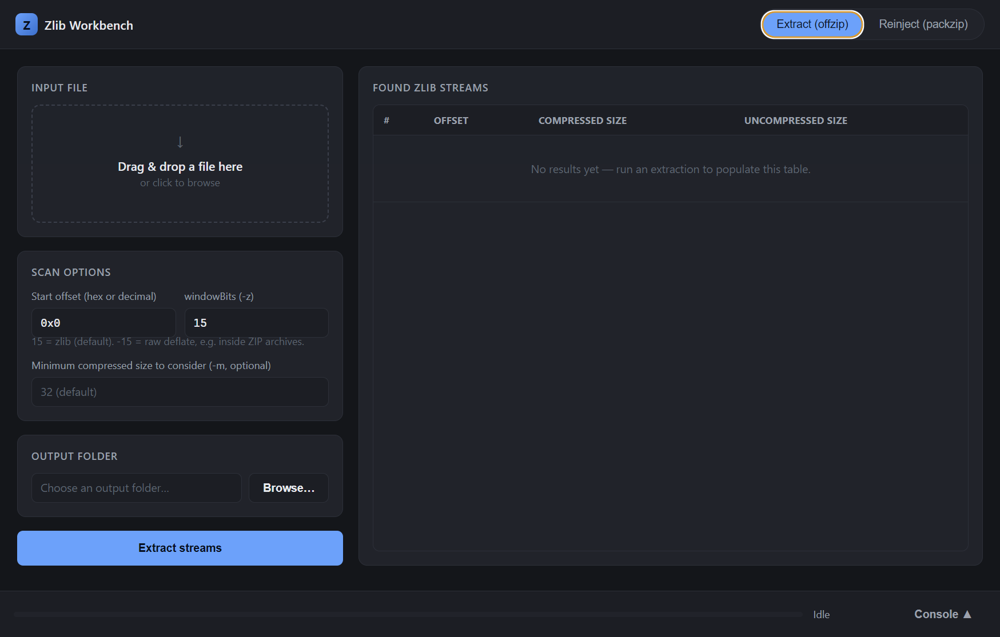
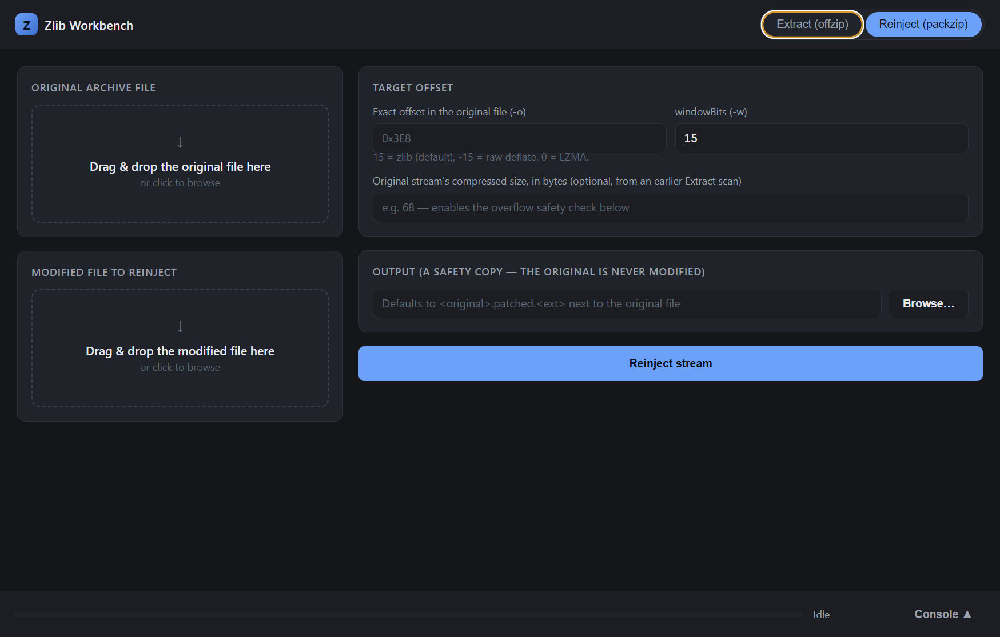

# Zlib Workbench

A dark-mode-first Electron GUI wrapping Luigi Auriemma's **Offzip** (extract
zlib/deflate streams from a file) and **PackZip** (recompress and reinject a
stream back into a file at a given offset) — the two classic CLI tools game
modders and file-format researchers use to pull apart and patch back together
zlib-compressed data inside arbitrary binary files.




## Features

- **Extract mode** — drag a file in, set a start offset / windowBits / minimum
  size, get a results table of every zlib/deflate stream found (offset,
  compressed size, uncompressed size), extracted into an output folder you pick.
- **Reinject mode** — drag in the original file and a modified replacement,
  give it a target offset, and it recompresses + splices the replacement back
  in. Click a row in the Extract results table to carry its offset and size
  straight over.
- **A real safety net, not just a wrapper.** PackZip has an undocumented
  footgun (below) — this app measures the actual recompressed size *before*
  touching anything, always works on a disposable copy, and blocks the write
  with an explicit confirmation if it would silently destroy data.
- Live console log of the underlying tool's raw output, and a progress
  indicator, for advanced users who want to see exactly what's happening.

## Quick start

Grab the installer from a [Release](../../releases) (or build it yourself,
below), run it, and go. No separate offzip/packzip install needed — the
compiled binaries are bundled in.

## Building from source

```bash
npm install
npm run dev        # launch with DevTools
```

```bash
npm run dist:win    # produce a Windows installer in dist/
```

Node.js is required. `bin/win32-x64/offzip.exe` and `packzip.exe` are already
built and committed, so you don't need a C toolchain unless you want to
rebuild them from the vendored source under `native/` (see
[native/offzip/README.md](native/offzip/README.md) and
[native/packzip/README.md](native/packzip/README.md)).

> **Windows + Developer Mode:** `npm run dist:win`'s NSIS installer step
> downloads an auxiliary `winCodeSign` package and needs to create symlinks
> while extracting it, which fails on Windows without either Developer Mode
> enabled (Settings → Privacy & security → For developers) or an elevated
> shell. This is an electron-builder quirk unrelated to actual code signing
> (none is configured here) — enabling Developer Mode is the simplest fix.
>
> If your project directory's path contains an `&` (or other shell
> metacharacter), run `node node_modules/electron-builder/cli.js --win`
> directly instead of `npm run dist:win` — npm scripts shell out via
> `cmd.exe` on Windows, which mis-parses such paths.

## Architecture

```
Renderer (Chromium, no Node)  <-- contextBridge -->  Preload  <-- IPC -->  Main process (Node)
                                                                                |
                                                                        child_process.spawn
                                                                                |
                                                                    bin/win32-x64/offzip.exe
                                                                    bin/win32-x64/packzip.exe
```

**Integration strategy: compiled CLI binaries + `child_process.spawn`, not
ffi-napi / a native Node addon.** Reasoning:

- Both tools are `main(argc, argv)` + `printf` programs. Turning them into a
  callable native module means refactoring their entry points, taming global
  state, and rebuilding a native addon against Electron's Node ABI per
  platform/arch — real ongoing cost for no benefit here.
- Spawning the `.exe` gets you **process isolation for free**: a crash on
  hostile/corrupt input takes down a child process, not the Electron app.
- Trivially cross-platform: recompile the same C source per OS/arch, drop the
  binary in the matching `bin/<platform>` folder.
- stdout/stderr streaming maps directly onto the progress bar and console log
  features — no extra plumbing needed.

## Directory layout

```
zlib-workbench/
├── package.json                  # Electron + electron-builder config
├── src/
│   ├── main/
│   │   ├── main.js               # app lifecycle + IPC handlers
│   │   ├── preload.js            # contextBridge: renderer-safe API surface
│   │   └── engine.js             # spawns offzip.exe/packzip.exe, parses output
│   └── renderer/
│       ├── index.html            # Extract / Reinject tabs
│       ├── css/style.css         # dark theme
│       └── js/renderer.js        # drag-drop, IPC calls, results table, console
├── native/
│   ├── offzip/src/               # original offzip.c, sign_ext.c, zopfli/, Makefile
│   ├── packzip/src/              # original packzip.c/.h, compression/, libs/ (lzma, 7z/advancecomp, uberflate, zopfli), Makefile
│   └── zlib/                     # (not needed -- see note below)
├── bin/win32-x64/                # offzip.exe, packzip.exe (already built, verified working)
├── scripts/build-native-win.ps1  # rebuilds native/*/src -> bin/win32-x64 if you ever need to
├── docs/                         # README screenshots
└── assets/icon.ico
```

> **Note on zlib:** the vendored `packzip` source bundles its own zopfli,
> AdvanceCOMP, LZMA SDK, and uberflate implementations under
> `native/packzip/src/libs/`, and `offzip` bundles zopfli too — so unlike a
> typical zlib-wrapping project, you likely do **not** need a separate zlib
> install to rebuild these from source. Check each tool's `Makefile` before
> assuming you need `native/zlib/`.

## Verified CLI contracts

Everything below was checked against the actual compiled binaries (usage
text, argument order, and a full extract → modify → reinject → re-extract
round-trip on a synthetic test file) — not just read from `--help` output.

### offzip 0.4.1

```
offzip.exe [options] <input> [output] [offset]
```

| Flag | Meaning |
|---|---|
| `-a` | extract ALL compressed streams found into the output folder |
| `-o` | overwrite existing output files without an interactive prompt (**required** for a GUI — offzip has no stdin to answer y/n on) |
| `-z NUM` | windowBits: `15` = zlib (default), `-15` = raw deflate (e.g. inside ZIP archives) |
| `-m SIZE` | minimum compressed size to consider (default 32) |
| `-L FILE` | dump a machine-readable list of found streams to `FILE` |

`engine.js` always passes `-a -o -L <temp file>` and parses that temp file
rather than scraping the fancy box-drawing console table. **Empirically
verified format** (the tool's own `--help` text compresses this to one line,
but the real file is two lines per stream):
```
0x<START_OFFSET>
0x<END_OFFSET> <zsizeDecimal> <sizeDecimal>
```

**Smart windowBits fallback:** if a scan with the requested `-z` value finds
zero streams and that value is one of the two common presets (`15` zlib /
`-15` raw deflate), `runOffzip()` automatically retries with the other one --
a raw-deflate-only file (e.g. data extracted from a ZIP) looks like "nothing
found" under the zlib default, and vice versa. Verified end-to-end against a
real raw-deflate-only fixture; the UI reflects back whichever windowBits
value actually worked. Raw-deflate scanning has no header magic bytes to
validate against, so expect more false positives than zlib scanning when the
fallback engages -- the console log calls this out when it happens.

**What `-s`/`-S` actually do (verified, not just read from `--help`):** despite
the name, `-s` alone does **not** extract anything -- it locates the first
stream from the given offset and reports where it is, writing no file at all.
`-S` is the same but keeps scanning the whole file (still no extraction).
Combining `-s` with `-a` has no special effect -- `-a` just extracts
everything from the offset onward, same as `-a` alone. There's no CLI
combination that means "extract exactly one stream and stop"; to grab a
single known stream, set Start Offset to its address and run a normal
Extract -- if other streams follow it in the file you'll get their files too,
but the one you want is right there, named by its offset.

### packzip 0.3.1

```
packzip.exe [options] <input> <output>
```
- `<input>` = the modified/replacement (uncompressed) data
- `<output>` = the archive being patched — if it already exists, packzip
  **injects** the newly-compressed data into it at `-o OFFSET` rather than
  overwriting the whole file

| Flag | Meaning |
|---|---|
| `-o OFF` | byte offset in `<output>` where the compressed data is written |
| `-w BITS` | windowBits, default `15` (zlib); negative = raw deflate; `0` = LZMA |
| `-c` | force-recreate `<output>` from scratch even if it already exists |

**⚠️ Verified safety caveat (found by testing, not documented up front by the
tool):** packzip does **not** shift or resize surrounding data.
- If the recompressed replacement is **≤** the original stream's size, it
  overwrites in place and the file's total length is unchanged (leftover
  bytes in the old slot become harmless padding).
- If it is **larger**, packzip truncates the file immediately after the
  newly written data — **silently discarding everything that came after it**
  in the original file.

**Also verified:** packzip writes essentially all of its status/report text
(including the "output size" line) to **stderr**, not stdout — offzip splits
its banner/summary to stdout but per-item progress ticks to stderr.
`engine.js`'s `runProcess()` captures both streams into a combined,
arrival-order `allLines` array for exactly this reason.

Because of this, `runPackzip()` in `engine.js`:
1. Never touches your original file — it always copies it to a working file
   first (`<original>.patched.<ext>` by default, or a path you choose).
2. Measures what packzip would *actually* produce, using a disposable scratch
   file (`packzip -o 0 -w BITS <replacement> <scratch>`, output file doesn't
   pre-exist so packzip takes its compress-only path — the resulting file's
   size equals the exact bytes that would be written).
3. If you supplied the original stream's known compressed size (auto-filled
   when you click a row in the Extract results table, or type it in
   manually) and the measured size exceeds it, the run stops **before**
   touching the working copy and the UI shows a warning banner with an
   explicit "I understand — inject anyway" confirmation button.

## UI feature map

| Requirement | Where |
|---|---|
| Extract/Reinject tabs | `#panel-extract` / `#panel-reinject` in `index.html`, toggled by `.mode-btn` in `renderer.js` |
| Drag-and-drop input file | `.dropzone` elements, `wireDropzone()` in `renderer.js` |
| Start offset / windowBits / min size inputs | `#extract-offset`, `#extract-windowbits`, `#extract-minsize` |
| Output directory picker | `#btn-pick-outdir` → `dialog:selectOutputDir` IPC → native folder picker |
| Results table (offset / compressed / uncompressed size) | `#extract-results-body`, populated from offzip's `-L` list file. **Click a row** to carry its offset + compressed size over to Reinject mode |
| Reinject original + modified dropzones, offset/windowBits fields | `#panel-reinject` |
| Overflow safety banner + confirm | `#reinject-overflow-warning`, `#btn-reinject-force` |
| Progress bar | `.progress-fill`, driven by `engine:progress` IPC events (indeterminate pulse — neither tool reports a clean byte-offset percentage) |
| Console log of raw engine output | `#console` / `#console-body`, fed by `engine:log` IPC events streamed line-by-line from stdout/stderr |

## Testing / driving the app

`.claude/skills/run-desktop/` has a Playwright-based driver for launching and
scripting the real Electron window (screenshots, clicks, direct calls into
`window.zlibWorkbench` for IPC-level checks) — see its `SKILL.md`. Used to
verify, against the actual binaries: both tabs render and switch correctly;
`runOffzip` through the real IPC bridge finds the right streams; and
`runPackzip`'s safe path, overflow-abort path, and forced-overflow path all
behave as documented above.

## Security notes baked in

- `contextIsolation: true`, `nodeIntegration: false`, `sandbox: true` on the
  `BrowserWindow` — the renderer only ever touches the explicit API surface
  in `preload.js`, never raw `fs`/`child_process`.
- A `Content-Security-Policy` meta tag locks the renderer to same-origin
  scripts/styles.
- Drag-and-drop file paths are resolved via `webUtils.getPathForFile`
  (`File.path` was removed in modern Electron for exactly this reason).
- Reinject mode never writes to your original file — see the safety caveat
  above.

## Credits & licensing

Offzip and PackZip are by **Luigi Auriemma** ([aluigi.org](https://aluigi.org)),
Copyright 2004–2019, licensed under the **GNU GPL v2 (or later)** — see the
header comments in `native/offzip/src/offzip.c` and `native/packzip/src/packzip.c`.
PackZip also bundles third-party compression libraries under their own
licenses: **zopfli** (Apache License 2.0, Google Inc.), the **LZMA SDK**
(public domain, Igor Pavlov), and modified **7-Zip**/AdvanceCOMP sources
(LGPL, see `native/packzip/src/libs/7z_advancecomp/README`).

This repository's own code (the Electron app in `src/`) doesn't yet declare
a license of its own — add a `LICENSE` file if you want to make its terms
explicit, keeping in mind that offzip/packzip's GPLv2 terms apply to any
distribution that combines/links their source directly (this project only
spawns their compiled binaries as separate processes, which is a materially
different arrangement, but it's worth understanding before you redistribute).
